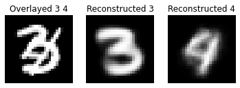
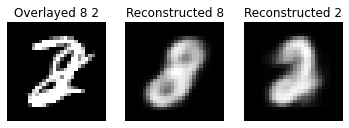

# 2022-CapsuleNetwork

This repository is an implementation of Capsule Network on MNIST, originally proposed in the paper [Dynamic Routing Between Capsules](https://proceedings.neurips.cc/paper/2017/hash/2cad8fa47bbef282badbb8de5374b894-Abstract.html) by Sara Sabour, Nicholas Frosst, and Geoffrey E. Hinton in NIPS, 2017. The implementation is in [TensorFlow](https://www.tensorflow.org)

## Prerequisites

It is recommended to use a virtual environment. For example, run the following command to create a virtual environment in anaconda with Python 3.8:
```shell
conda create -n capsnet python=3.8
```
Then, run the following command to activate the virtual environment created in the example above:

```shell
conda activate capsnet
```

Install all the required dependencies by running the following command:

```shell
pip install -r requirements.txt
```

The requirements are specified as below.

 - numpy==1.21.5
 - tensorflow==2.8.0
 - tensorflow-datasets==4.5.2
 - matplotlib==3.5.2

## Train the Model

```shell
python train_mnist.py
```

You can also use different choices of hyper-parameters and options. The default parameter values are proposed in the original paper

```shell
  -h, --help            show this help message and exit
  --batch-size BATCH_SIZE
                        batch size for training, validating and testing, 32 by default
  --epochs EPOCHS       number of epochs for training, 100 by default
  --learning-rate LEARNING_RATE
                        initial learning rate, 0.001 by default
  --lr-decay-rate LR_DECAY_RATE
                        learning rate decay factor, 0.8 by default
  --lr-decay-steps LR_DECAY_STEPS
                        steps to take until the next decay, 10000 by default
  --save-model SAVE_MODEL
                        whether to save the model or not, True by default
  --model-path MODEL_PATH
                        path to save the trained model, ./model by default
  --gpu GPU             ids of the GPUs to run the program on, use : to indicate the slice, 0 by default
```

## Visualize the Reconstruction of Tweaking Values in Capsule Vectors

Use options `--digit` and `--dimension` to specify which dimension of which digit vector you want to see the effect of on the reconstructed image.

```shell
python tweak_visualize.py --digit <digit> --dimension <dimension>
```

```shell
  -h, --help            show this help message and exit
  --model-path MODEL_PATH
                        path to load the trained model, ./model by default
  --digit DIGIT         the target digit to visualize on, 6 by default
  --dimension DIMENSION
                        the target dimension of the digit to visualize on, 5 by default
  --lower-difference LOWER_DIFFERENCE
                        the lower difference bound for the target value, -0.25 by default
  --upper-difference UPPER_DIFFERENCE
                        the upper difference bound for the target value, 0.25 by default
```

## Visualize the Reconstruction of Overlaying Two Images of Different Digits

The digits and images are randomly chosen.

```shell
python overlay_visualize.py
```

```shell
  -h, --help            show this help message and exit
  --model-path MODEL_PATH
                        path to load the trained model, ./model by default

```

## Results

### Accuracy on Test Set

|Accuracy|Reported Accuracy|
|--|--|
|99.22%|99.75%|

### Reconstruction of Tweaking Values

Dimension 5 in digit vector 6


Dimension 0 in digit vector 2


Dimension 1 in digit vector 2


Dimension 3 in digit vector 2


### Reconstruction of Overlaying Images





